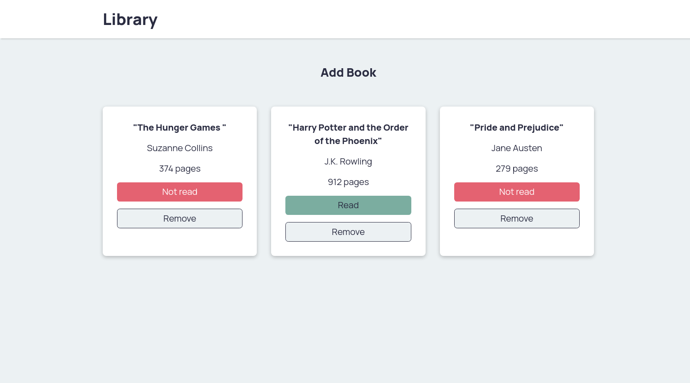

# Library App

This is a library application on The Odin Project.  Users can submit books that take the title, author, pages, and read status.  Books can be removed from the library and the read status can be changed.  

## Screenshot

## Live Link
[kpax10.github.io/Library/](https://kpax10.github.io/Library/)

## Future Development

-Adding local storage
-Form validation working, but no validation is displayed